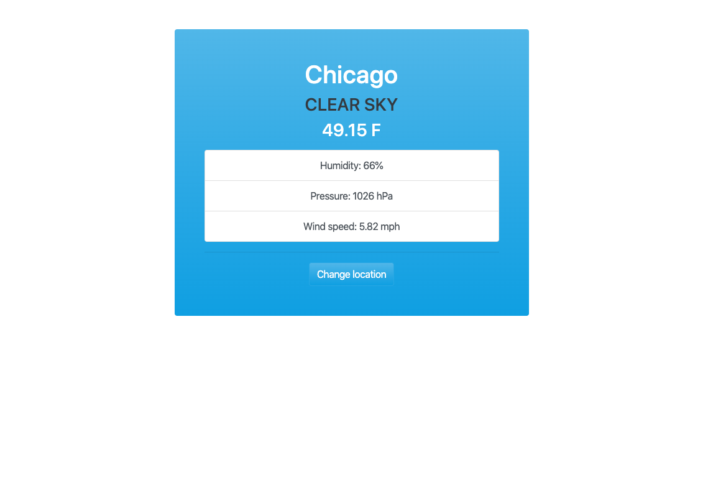

### WeatherJs
- A vanilla JavaScript project where I used the API form [OpenWeatherMap](https://openweathermap.org/) to build a simple weather app
- The app gives you the location(city) with the temprature, general conditions, humidity, pressure and wind speed
- You can change the location by selecting the city and country code

------------------------------------------------
